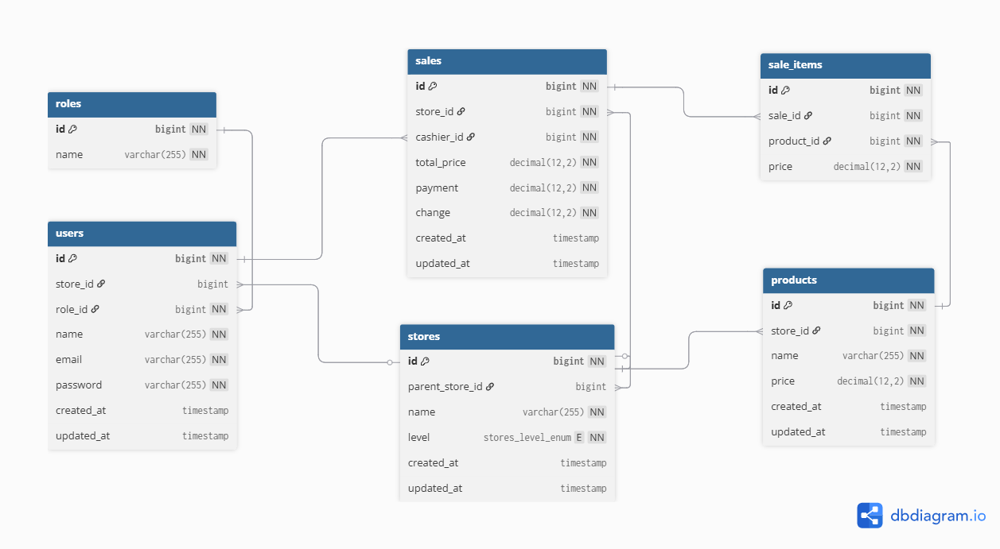

# 🏪 MANAJEMEN TOKO API

Backend REST API untuk sistem Manajemen Toko dengan role:
- Super Admin
- Admin
- Kasir

Menggunakan JWT sebagai autentikasi.

---

## ⚙️ Tech Stack
- Laravel
- MySQL
- JWT Auth (tymon/jwt-auth)

---

## 🔐 ERD


https://dbdiagram.io/d/69707ee0bd82f5fce21e2a89

### POSTMAN
```http
https://documenter.getpostman.com/view/5221370/2sBXViiqiw
```

## Instalasi

### 1. Clone Repository
Clone repository ini ke direktori lokal kamu menggunakan perintah berikut:

```bash
git clone [link-project]
cd [name-project]
```

### 2. Install Dependencies
Jalankan perintah berikut untuk menginstall semua dependencies PHP:

```bash
composer install
```

### 3. Konfigurasi Environment
Salin file `.env.example` ke `.env` dan sesuaikan konfigurasi database dan lainnya sesuai kebutuhan kamu:

```bash
cp .env.example .env
```

Generate application key:

```bash
php artisan key:generate
php artisan jwt:secret
```

### 4. Migrasi Database
Jalankan migrasi untuk membuat tabel-tabel di database:

```bash
php artisan migrate
php artisan db:seed
```

### 5. Menjalankan Aplikasi
Jalankan server pengembangan Laravel dengan perintah berikut:

```bash
php artisan serve
```

Sekarang kamu bisa mengakses aplikasi di `http://localhost:8000`.

## Strukur Direktori
Beberapa direktori penting dalam proyek ini adalah:

- `resources/views`: Direktori untuk file blade Laravel.
- `routes`: Direktori untuk file rute Laravel.
- `database/migrations`: Direktori untuk file migrasi database.

## Lisensi
Proyek ini dilisensikan di bawah [MIT License](LICENSE).